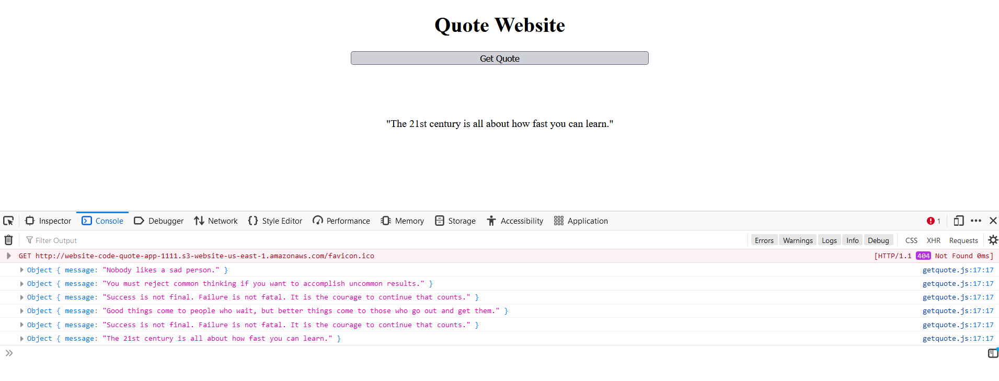
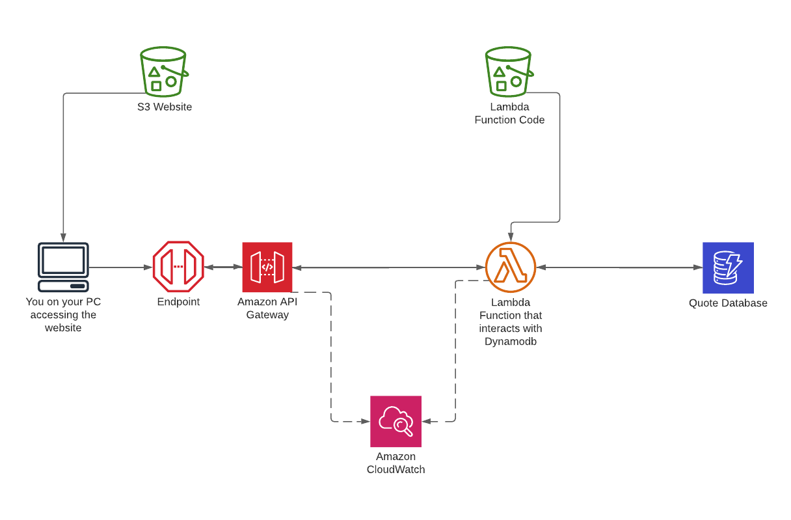
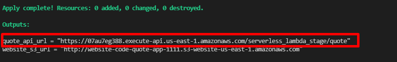
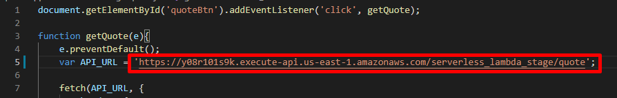
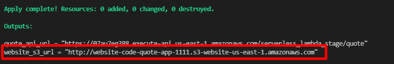

# Quote App / Terraform AWS Deployment

# What is this?
This is a web application that allows you to request a random quote. 


# Architecture

Everything is deployed to AWS using Terraform. That includes the IAM policies, the website code, the DynamoDB table data, etc...  You can view the ```main.tf``` file to get a better idea of everything that is deployed.

## Basic overview:
* User goes to a static website which is hosted in S3
* When the "Get Quote" button is clicked, it calls an API Gateway endpoint
* The api triggers a lamdbda function
* The lamdba function queries dynamodb and returns a random quote from the database
* The random quote is sent back to the client PC and is displayed in a ```<p>``` HTML element

## Technical challenges:
From my research, there is no native way to query a random item in DynamoDB (which is a sham because that option exists in other database types). There are creative solutions that can make this possible, but most have some sort of major draw back or require additional heavy lifiting. To eliminate some complexity in this project, I set the partition key of the DynamoDb table as "id" and inserted 10 records that each contiained an id within 1-10. Then in the lambda function, I queried dynamodb for a random id inside the range 1-10. A better long-term/scalable solution would probably be to use a database that allows for searching random records. 

***
# Get it up and running:
1. Run terraform apply to build the terraform resources:
```
terraform apply --auto-approve
```
2. Grab the "quote_api_ url output":

3. Update the website javascript file to use that new api url:

4. Run another apply to update the website code:
```
terraform apply --auto-approve
```
5. The site should now be operational. You can use the website url output to quickly get to the static website:



***
# Important notes
* I could have broken some of the resources into modules - I just didnt want to go through that extra work for this particular project
* I am aware that the website UI looks like trash. That wasn't the main focus of the project.
***
# Some Technical Notes
* Test invoke the function: aws lambda invoke --region=us-east-1 --function-name=$(terraform output -raw function_name) response.json
* curl: curl "$(terraform output -raw base_api_url)/quote"

***
# Documentation / Guides
* I used this guide as a starting point for this project: https://learn.hashicorp.com/tutorials/terraform/lambda-api-gateway
* Lambda Handler: https://docs.aws.amazon.com/lambda/latest/dg/python-handler.html
* Parsing a JSON object with JS: https://www.freecodecamp.org/news/json-stringify-example-how-to-parse-a-json-object-with-javascript/
* More parsing a JSON object with JS: https://www.tutorialrepublic.com/javascript-tutorial/javascript-json-parsing.php
* Javascript textContent property: https://www.w3schools.com/jsref/prop_node_textcontent.asp
* Javascript addEventListener() method: https://www.w3schools.com/jsref/met_element_addeventlistener.asp
* simple microservice using Lambda and API Gateway: https://docs.aws.amazon.com/lambda/latest/dg/services-apigateway-blueprint.html
* You dont have to define all dynamodb attributes up front: https://newbedev.com/terraform-dynamodb-all-attributes-must-be-indexed
* DynamoDB partition key: https://aws.amazon.com/blogs/database/choosing-the-right-dynamodb-partition-key/
* Using terraform to write bulk items to dynamodb: https://jacob-hudson.github.io/terraform/aws/dynamodb/2020/04/27/terraform-bulk-upload.html
* Query DynamoDB: https://docs.aws.amazon.com/amazondynamodb/latest/developerguide/GettingStarted.Python.04.html
* DynamoDB and Boto3: https://boto3.amazonaws.com/v1/documentation/api/latest/guide/dynamodb.html
* Getting started guide: https://docs.aws.amazon.com/amazondynamodb/latest/developerguide/GettingStarted.Python.html
* Lambda exception handling: https://towardsdatascience.com/why-you-should-never-ever-print-in-a-lambda-function-f997d684a705
* key provided does not match the schema: https://stackoverflow.com/questions/42757872/the-provided-key-element-does-not-match-the-schema-error-when-getting-an-item
* list indicies must be integers: https://stackoverflow.com/questions/55054007/not-being-able-to-get-a-value-from-a-dictionary
- and:  https://docs.aws.amazon.com/amazondynamodb/latest/developerguide/GettingStarted.Python.04.html
***